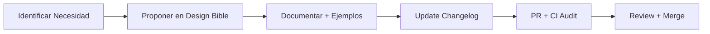

# Governance - ATLAS Design Bible

> Proceso de cambios, versionado y gobernanza del sistema de diseño

## 📋 Proceso de Cambios

### 1. Propuesta de Cambio

Cualquier modificación visual debe seguir este flujo:



#### Casos que Requieren Cambio
- ✅ Nuevo componente UI
- ✅ Modificación de tokens (colores, espaciado)
- ✅ Nuevo patrón de interacción
- ✅ Cambio en guidelines de accesibilidad
- ✅ Actualización de tono de voz

#### Casos que NO Requieren Cambio
- ❌ Fix de bugs sin impacto visual
- ❌ Cambios de implementación técnica (mismo resultado visual)
- ❌ Mejoras de performance sin cambio visual

### 2. Documentación Requerida

Cada cambio debe incluir:

```markdown
## [Tipo] Nombre del Cambio

### Problema/Necesidad
Descripción del problema que soluciona o necesidad que cubre

### Solución Propuesta
Especificación exacta del cambio

### Impacto
- ✅ Componentes afectados
- ✅ Páginas que requieren actualización  
- ✅ Breaking changes (si los hay)

### Ejemplos
Código y capturas de pantalla del antes/después

### Testing
Cómo validar que el cambio funciona correctamente
```

## 📦 Versionado Semántico

### Esquema: `design-vX.Y.Z`

```
MAJOR (X): Breaking changes - requiere actualización manual
MINOR (Y): Nuevos componentes/tokens - backward compatible  
PATCH (Z): Fixes y mejoras menores
```

### Ejemplos

```
design-v1.0.0  → Release inicial
design-v1.1.0  → Nuevo componente DatePicker
design-v1.1.1  → Fix contraste en chips warning
design-v2.0.0  → Cambio breaking en color tokens
```

### Changelog Format

```markdown
# Changelog

## [design-v1.2.0] - 2024-03-15

### Added
- Nuevo componente Modal con overlay claro
- Patrón EmptyState para listas vacías
- Token `--radius-xl` para elementos grandes

### Changed  
- Mejorado contraste en chips warning (WCAG AA)
- Actualizado espaciado en tablas densas

### Fixed
- Focus visible en botones secondary
- Alineación de iconos en navegación

### Deprecated
- `--old-blue` será eliminado en v2.0.0

### Removed
- N/A

### Breaking Changes
- N/A
```

## 🚦 Estados de Componentes

### Lifecycle

```
💡 EXPERIMENTAL  → En desarrollo, puede cambiar
🚧 BETA         → Estable pero refinando detalles  
✅ STABLE       → Listo para producción
⚠️  DEPRECATED  → Usar alternativa recomendada
❌ REMOVED      → Ya no disponible
```

### Documentación

```markdown
## Button Component

**Estado**: ✅ STABLE desde design-v1.0.0
**Última actualización**: design-v1.1.2

### Variantes Disponibles
- Primary (estable)
- Secondary (estable)  
- Destructive (estable)
- Ghost (🚧 beta - refinando hover states)

### Migration Guide
Para migrar desde versiones anteriores...
```

## 👥 Roles y Responsabilidades

### Design System Team
- **Mantenimiento** del Design Bible
- **Revisión** de propuestas de cambio
- **Documentación** de nuevos componentes
- **Comunicación** de updates al equipo

### Desarrolladores
- **Proponer** nuevos componentes/patterns necesarios
- **Implementar** cambios siguiendo especificaciones
- **Feedback** sobre usabilidad de components
- **Testing** de componentes en contexto real

### Product/Design
- **Validar** coherencia con objetivos del producto
- **Proponer** mejoras de UX
- **Priorizar** desarrollos de componentes
- **Approval** de cambios que afecten UX

### QA
- **Validar** compliance con Design Bible
- **Testing** de accesibilidad
- **Verificar** consistencia visual
- **Regression testing** después de updates

## 🔍 Review Process

### 1. Proposal Review
```
Criterios de Evaluación:
- ✅ ¿Resuelve un problema real?
- ✅ ¿Es consistente con principios ATLAS?
- ✅ ¿Tiene documentación completa?
- ✅ ¿Incluye casos de uso y ejemplos?
- ✅ ¿Considera accesibilidad?
```

### 2. Technical Review  
```
Criterios Técnicos:
- ✅ ¿Pasa auditoría CI?
- ✅ ¿Es implementable?
- ✅ ¿Mantiene performance?
- ✅ ¿Compatible con tokens existentes?
- ✅ ¿Testing plan definido?
```

### 3. Design Review
```
Criterios de Diseño:
- ✅ ¿Mantiene coherencia visual?
- ✅ ¿Sigue patterns establecidos?
- ✅ ¿Funciona en todos los dispositivos?
- ✅ ¿Cumple estándares de accesibilidad?
- ✅ ¿Documentación visual clara?
```

## 📢 Comunicación de Cambios

### Tipos de Comunicación

#### Major Release (Breaking Changes)
```
🚨 ATLAS Design System v2.0.0

BREAKING CHANGES:
- Color tokens actualizados (migración requerida)
- Componente Button API modificada

MIGRATION GUIDE:
[Link a guía detallada]

DEADLINE: 2 semanas para migración
```

#### Minor Release (Nuevas Features)
```
🎉 ATLAS Design System v1.3.0

NUEVOS COMPONENTES:
- Modal con overlay claro
- EmptyState pattern

DISPONIBLE: Inmediatamente
DOCS: [Link actualizado]
```

#### Patch Release (Fixes)
```
🔧 ATLAS Design System v1.2.1

FIXES:
- Mejorado contraste en warning chips
- Corregido focus en inputs

Auto-aplicado en próximo deployment
```

### Canales de Comunicación

1. **Slack #design-system** → Updates inmediatos
2. **Email design-updates** → Resúmenes semanales  
3. **Design Bible** → Documentación oficial
4. **Stand-ups** → Discusión de impacts

## 📊 Métricas y Adoption

### Tracking de Uso

```typescript
// Métricas a trackear
const designSystemMetrics = {
  componentUsage: {
    'Button': 245,  // Número de instancias
    'Modal': 12,
    'EmptyState': 8
  },
  
  tokenUsage: {
    '--atlas-blue': 89,  // Número de referencias
    '--atlas-teal': 34,
    '--custom-color': 2  // ⚠️ Uso no estándar
  },
  
  complianceScore: 94,  // % de cumplimiento CI
  accessibilityScore: 87  // % WCAG AA
};
```

### Reports Mensual

```markdown
## Design System Report - Marzo 2024

### Adoption
- 94% compliance score (🔺 +3% vs febrero)
- 12 nuevos componentes implementados
- 0 violations críticas detectadas

### Usage Top 10
1. Button (245 usos)
2. Card (189 usos)  
3. Input (167 usos)
...

### Issues
- 3 componentes custom detectados → migrar a estándar
- 2 color tokens no-estándar → sustituir

### Next Month
- Release v1.4.0 con DatePicker
- Workshop accesibilidad
- Migration guides actualizados
```

## 🎯 Objetivos y KPIs

### Objetivos 2024

1. **Compliance**: >95% CI audit pass rate
2. **Adoption**: 100% componentes usando Design Bible  
3. **Accessibility**: 100% WCAG AA compliance
4. **Performance**: <1% impacto en bundle size
5. **Developer Experience**: <2min tiempo promedio implementación

### KPIs Mensual

```
✅ Compliance Score: 94% (target: >95%)
✅ Component Coverage: 89% (target: >90%)  
⚠️ Accessibility Score: 87% (target: >95%)
✅ PR Review Time: 1.2 days (target: <2 days)
❌ Documentation Updates: 70% (target: >90%)
```

## 🔄 Versión

**v1.0.0** - Proceso inicial de governance establecido