# AUDIT · ESTADO REAL DEL REPOSITORIO · julio 2026

> **Tipo** · auditoría de solo lectura (cero cambios en `src/`, cero bump de `DB_VERSION`).
> **Método** · toda afirmación sobre el código lleva `path:línea`; cuando la evidencia no es un punto del código sino un hecho del repo (estado de git, PRs, conteos), se respalda con el **comando** que lo produce (`git …`, `mcp …`, `grep …`) o se marca como inferencia explícita. Lo no encontrado se marca `NO ENCONTRADO`. Las incoherencias con lo que la tarea daba por supuesto se marcan **CONTRADICCIÓN**.
> **Fecha de generación** · 2026-07-18 · **Rama** · `claude/new-session-6aei1o` (auditoría) sobre base `main`.

### Nota metodológica (leer antes que nada)

1. Los conteos de **escritores/lectores** por store se obtuvieron por `grep` mecánico de los literales `.put('store'` / `.add('store'` / `.delete('store'` / `.clear('store'` (escritores) y `.get('store'` / `.getAll('store'` / `.getAllFromIndex('store'` / `.getFromIndex('store'` / `.count('store'` (lectores), excluyendo `__tests__` y `*.test.*`.
2. **Punto ciego conocido:** los accesos que usan una **variable** en vez del literal (p. ej. `const STORE = 'valoracionesActivos'; db.put(STORE, …)` en `src/services/valoracionesService.ts:33,190,235`) o los que van por **transacción** (`db.transaction(['x'],'readwrite').objectStore('x').put(…)`) NO los captura el grep de literales. Donde un store salió con 0 escritores/lectores literales, se verificó a mano por transacción/variable y se anota el resultado real. Por tanto los conteos son un **suelo**, no un absoluto.
3. Ningún archivo de `src/` fue modificado. El único archivo nuevo es este documento.

---

## 1 · Identidad del repositorio

| Dato | Valor | Evidencia |
|---|---|---|
| Rama de trabajo (auditoría) | `claude/new-session-6aei1o` | `git branch --show-current` |
| Rama base / default | `main` | `git branch -a` |
| HEAD (hash corto) | `f97122b` | `git log -1` |
| Fecha último commit | **2026-06-12 17:12:35 -0500** | `git log -1` |
| Mensaje último commit | `fix(onboarding): atender review de Copilot del bloque nómina · persistencia de progreso + prefill reactivo (#1422)` | `git log -1` |
| `DB_VERSION` real | **79** | `src/services/db.ts:32` |
| Antigüedad | último commit hace **~5 semanas** respecto a la fecha de auditoría (2026-07-18) | consistente con "proyecto parado" |

**CONTRADICCIÓN 1 · conteo de stores.** El comentario de `DB_VERSION` afirma *"45 stores totales"* (`src/services/db.ts:32`), pero la interfaz `AtlasHorizonDB` declara **49 claves** (`src/services/db.ts:2271-2563`) y hay **48 llamadas `createObjectStore` distintas** en el `upgrade()`. Ni "45", ni "49", ni "48" coinciden entre sí (detalle en §2). El número "45" del comentario **no es verificable** contra el esquema real.

### Ramas abiertas distintas de `main`

Solo la rama de auditoría actual (`claude/new-session-6aei1o`, local y en `origin`). No hay otras ramas de feature vivas en local; el trabajo pendiente vive en Pull Requests (abajo).

### Pull Requests abiertos sin mergear

**Total: 51 PRs abiertos** (`mcp github list_pull_requests`, estado `open`, 2 páginas). El más antiguo es **#106**. Selección relevante (nº · fecha · título):

| Nº | Fecha | Título (abreviado) |
|---|---|---|
| 1302 | 2026-05-08 | `feat(proyeccion): C-PROY-3 sustituir Math.random forecast por motor real` |
| 1252 | 2026-05-03 | `docs(audit): estado pre-T34 · stores · disparos · UI gastos · compromisos` |
| 1025 | 2026-04-06 | `[WIP] Fix handling of contracts and incomes without NIF in leases` |
| 992 | 2026-04-03 | `Delete obsolete IndexedDB stores in v42 upgrade` |
| 945 | 2026-03-31 | `Add package.json validation script for Netlify troubleshooting` |
| 880 | 2026-03-23 | `Fiscal module overhaul: route renames, UI refactor, cold-start and historic flow` |
| 855 | 2026-03-22 | `Reconciliación avanzada AEAT ↔ ATLAS (servicio + UI + integración)` |
| 843 | 2026-03-21 | `feat(fiscal): foundation model for fiscal years, DB stores and service` |
| 750/749/748/747 | 2026-03-19 | `Fix sale reversal: robust executionJournal storage…` (**4 PRs duplicados**) |
| 802/801, 794/795, 797/798, 789/790, 760/761, 719/720 | 2026-03 | **pares de PRs duplicados** (mismo título ×2) |
| 106 | (más antiguo) | `[WIP] Conectar con APIs reales de backend` |

**Observación:** de los 51 abiertos, un número significativo son **duplicados exactos** (p. ej. #747–#750 son 4 copias del mismo fix, además de ≥6 pares dobles) y varios `[WIP]` de hace >3 meses. Es un backlog de PRs sin higiene, no 51 frentes independientes.

---

## 2 · Inventario de object stores

Cada fila es la **ficha** del store. Columnas: `path:línea` de creación · keyPath/AI · escritores (nº de archivos distintos, no-test; entre `[]` los archivos) · lectores (nº literal) · FK reales · veredicto. `path:línea` representativos de un escritor y un lector se listan bajo la tabla para los stores no triviales.

Leyenda veredicto: ✅ VIVO · ⚠ SOLO LECTURA (nadie escribe desde runtime real) · ⚠ SOLO ESCRITURA · ⚠ SERVICIO ESCRITOR MUERTO (se escribe, pero el servicio que escribe no lo llama ninguna pantalla) · ⛔ HUÉRFANO/LEGACY.

| Store | Def `path:línea` | keyPath · AI | Escritores (nº · archivos) | Lect. (nº) | FK reales | Veredicto |
|---|---|---|---|---|---|---|
| properties | db.ts:2675 | id · sí | 14 · [inmuebleService, inmueblesImportCreationService, inmuebleDeleteService, datosFiscalesService, propertySaleService, reconciliacionService, declaracionDistributorService, declaracionOnboardingService, prestamosImportCreationService, fiscalLifecycleService, contractImportCreationService, +migraciones, db] | 121 | raíz (sin FK saliente) | ✅ VIVO |
| property_sales | db.ts:2681 | id · sí | 1 · [propertySaleService] (vía transacción :834/:1031/:1352) | 7 | propertyId→properties | ✅ VIVO |
| documents | db.ts:2696 | id · sí | 7 · [documentIngestionService, fiscalHistoryService, emailIngestService, declaracionDistributorService, documentMatchingService, migrationService, db] | 27 | metadata.entityId→(polimórfico) | ✅ VIVO |
| contracts | db.ts:2704 | id · sí | 7 · [contractService, documentIngestionService, vinculacionFiscalService, alquileresV3FixService, propertySaleService, +migración, db] | 54 | propertyId→properties | ✅ VIVO |
| botesAnualesSinIdentificar | db.ts:2723 | id · sí | 2 · [boteAnualService, alquileresV3FixService] | 7 | inmuebleId→properties | ✅ VIVO (V78) |
| aeatCarryForwards | db.ts:2742 | id · sí | 2 · [carryForwardService, fiscalSummaryService] | 4 | propertyId→properties | ✅ VIVO |
| propertyDays | db.ts:2750 | id · sí | 1 · [propertyOccupancyService] | 4 | propertyId→properties | ⚠ SERVICIO ESCRITOR MUERTO (ver §4) |
| **gastosInmueble** | db.ts:2767 | id · sí | 3 · [gastosInmuebleService, propertySaleService, migración] | 19 | inmuebleId→properties; origen-origenId→polimórfico | ✅ VIVO · **CONTRADICCIÓN 2** |
| **mejorasInmueble** | db.ts:2786 | id · sí | 4 · [mejorasInmuebleService, migracionGastosService, +migraciones] | 9 | inmuebleId→properties | ✅ VIVO · **CONTRADICCIÓN 2** |
| **mueblesInmueble** | db.ts:2800 | id · sí | 3 · [mueblesInmuebleService, migracionGastosService, migración] | 6 | inmuebleId→properties | ✅ VIVO · **CONTRADICCIÓN 2** |
| proveedores | db.ts:2760 | nif · no | 1 · [declaracionDistributorService] | 1 | (raíz por NIF) | ✅ VIVO (mínimo) |
| accounts | db.ts:2841 | id · sí | 5 · [cuentasService, treasuryApiService, treasuryEventsService, accountBalanceService, demoDataCleanupService] | 72 | raíz tesorería | ✅ VIVO |
| movements | db.ts:2849 | id · sí | 16 · [ver §2.b] | 51 | accountId→accounts; importBatch→importBatches | ✅ VIVO |
| importBatches | db.ts:2860 | id · no | 2 · [treasuryApiService, bankStatementOrchestrator] | 2 | accountId→accounts | ✅ VIVO |
| treasuryEvents | db.ts:2867 | id · sí | 10 · [ver §2.b] | 52 | accountId→accounts; sourceId+sourceType→polimórfico | ✅ VIVO |
| presupuestos | db.ts:2900 | id · no | 1 · [presupuestoService] | 6 | (año) | ✅ VIVO |
| presupuestoLineas | db.ts:2907 | id · no | 1 · [presupuestoService] | 4 | presupuestoId→presupuestos; inmuebleId→properties; cuentaId→accounts; contratoId→contracts; prestamoId→prestamos | ✅ VIVO |
| movementLearningRules | db.ts:2930 | id · sí | 1 · [movementLearningService] | 4 | (learnKey único) | ✅ VIVO |
| inversiones | db.ts:3019 | id · sí | 5 · [inversionesService, valoracionesService, indexaCapitalImportService, declaracionDistributorService, migración] | 33 | raíz | ✅ VIVO |
| personalData | db.ts:2942 | id · sí | 1 · [personalOnboardingService] | 4 | raíz personal (singleton id=1) | ✅ VIVO |
| personalModuleConfig | db.ts:2948 | personalDataId · no | vía transacción · [personalDataService:89] | vía tx | personalDataId→personalData | ✅ VIVO (grep literal=0; escribe/lee por transacción) |
| ingresos | db.ts:2958 | id · sí | 4 · [treasuryCreationService, enhancedTreasuryCreationService, incomeReconciliationService, v70-nomina-historial] | 18 | personalDataId→personalData | ✅ VIVO |
| planesPensiones | db.ts:2993 | id · no | 4 · [planesPensionesService, valoracionesService, aeatPlanesPensionesImportService, traspasosPlanPensionesService] | 26 | personalDataId→personalData | ✅ VIVO |
| aportacionesPlan | db.ts:3001 | id · no | 6 · [aportacionesPlanService, planesPensionesService, aeatPlanesPensionesImportService, indexaCapitalImportService, inversionesAportacionesImportService, nominaAportacionHook] | 9 | planId→planesPensiones; ingresoIdNomina→ingresos | ✅ VIVO |
| traspasosPlanPensiones | db.ts:3010 | id · sí | 3 · [traspasosPlanPensionesService, planesPensionesService, aeatPlanesPensionesImportService] | 4 | planId→planesPensiones | ✅ VIVO |
| traspasosPlanes | (solo tipo db.ts:2357; `deleteObjectStore` :4355) | — | 0 | 0 | — | ⛔ LEGACY (retirado V65; type sobrevive por migración) |
| prestamos | db.ts:3034 | id · no | 9 · [prestamosService, loanService, loanSettlementService, treasuryConfirmationService, propertySaleService, +migraciones] | 29 | inmuebleId→properties | ✅ VIVO |
| valoracionesActivos | db.ts:3049 | id · sí | vía variable STORE · [valoracionesService:190/:235] | 3+ | activoId→(properties/inversiones/planesPensiones) polimórfico | ✅ VIVO (grep literal=0; escribe por variable) |
| valoraciones_historicas | (solo tipo db.ts:2388) | — | 1 · [planesPensionesService:192 `.delete` idempotente] | 3 (legacy) | — | ⛔ HUÉRFANO (store físico eliminado en V74; solo `delete` de limpieza + type) |
| keyval | db.ts:3029 | (out-of-line) | 16 · [ver §2.b] | 28 | config key-value | ✅ VIVO |
| objetivos_financieros | db.ts:2691 (bajo `oldVersion<32`) | id · no | 0 | 0 | — | ⛔ LEGACY (migrado a `escenarios` en V5.4; type + creación bajo guard para DBs viejas) |
| resultadosEjercicio | db.ts:3074 | id · sí | 1 · [fiscalHistoryService] | 1 | ejercicio | ✅ VIVO (delgado) |
| arrastresIRPF | db.ts:3083 | id · sí | 2 · [fiscalHistoryService, migración] | 4 | inmuebleId→properties | ✅ VIVO |
| perdidasPatrimonialesAhorro | db.ts:3093 | id · sí | 2 · [fiscalLifecycleService, compensacionAhorroService] | 6 | ejercicioOrigen | ✅ VIVO |
| snapshotsDeclaracion | db.ts:3101 | id · sí | 1 · [fiscalHistoryService] | 2 | ejercicio | ✅ VIVO |
| entidadesAtribucion | db.ts:3108 | id · sí | 1 · [entidadAtribucionService] | 4 | nif | ✅ VIVO |
| ejerciciosFiscalesCoord | db.ts:3116 | año · no | 3 · [ejercicioResolverService, ejercicioFiscalService, declaracionDistributorService] | 34 | coordinador fiscal (año) | ✅ VIVO (núcleo fiscal) |
| vinculosAccesorio | db.ts:3122 | id · sí | 2 · [declaracionDistributorService, migración] | 2 | inmueblePrincipalId/inmuebleAccesorioId→properties | ✅ VIVO (delgado; `vinculosAccesorioService` es muerto, ver §4) |
| compromisosRecurrentes | db.ts:3252 | id · sí | 3 · [propertySaleService, +migraciones v68/T34] | 11 | (ámbito) | ✅ VIVO |
| viviendaHabitual | db.ts:3267 | id · sí | 1 · [personal/viviendaHabitualService:55 `guardarVivienda`] | 1 | raíz personal (singleton) | ✅ VIVO |
| escenarios | db.ts:3638 | id · no | 2 · [escenariosService, db] | 2 | singleton libertad | ✅ VIVO |
| objetivos | db.ts:3571 | id · no | 2 · [objetivosService, fondosService] | 13 | fondoId→fondos_ahorro; prestamoId→prestamos | ✅ VIVO |
| fondos_ahorro | db.ts:3586 | id · no | 2 · [objetivosService, fondosService] | 13 | (propósito) | ✅ VIVO |
| retos | db.ts:3599 | id · no | 1 · [retosService] | 7 | (mes único) | ⚠ SERVICIO ESCRITOR MUERTO (`retosService` sin importadores, ver §4) |
| deudasFiscales | db.ts:3131 | id · sí | 1 · [deudasFiscalesService] | 6 | modelo/ejercicio | ✅ VIVO (V71) |
| benchmarksReferencia | db.ts:3150 | id · no | 1 · [benchmarksReferenciaService] | 7 | codigo | ✅ VIVO (V72) |
| avisosUsuario | db.ts:3165 | avisoId · no | 1 · [avisosUsuarioService] | 2 | avisoId | ✅ VIVO (V73) |
| objetivosVitales | db.ts:3173 | id · no | 1 · [objetivosVitalesService] | 3 | planFinancieroAsociado | ✅ VIVO (V73) |
| **gastos** | *(solo tipo db.ts:2292; sin `createObjectStore`)* | — | 0 | 0 | — | ⛔ FANTASMA · **CONTRADICCIÓN 2** |
| **propertyImprovements** | *(solo tipo db.ts:2281; sin `createObjectStore`)* | — | 0 | 0 | — | ⛔ FANTASMA · **CONTRADICCIÓN 2** |
| **fiscalSummaries** | *(solo tipo db.ts:2291; sin `createObjectStore`)* | — | 0 | 1 (`migracionGastosService:29`) | — | ⛔ FANTASMA · **CONTRADICCIÓN 3** |
| **operacionesFiscales** | *(solo tipo db.ts:2282; sin `createObjectStore`)* | — | 0 | 1 (`migracionGastosService:142`) | — | ⛔ FANTASMA · **CONTRADICCIÓN 3** |

### 2.b · path:línea representativos de stores multi-escritor

- **movements** (16 escritores): `.delete` en `src/modules/tesoreria/pages/VistaCuentaPage.tsx:826`; `.getAll` en `src/modules/mi-plan/wizards/utils/getCurrentSaldoCuenta.ts:40`. Otros escritores: `budgetMatchingService`, `budgetReclassificationService`, `treasuryApiService`, `treasuryForecastService`, `treasuryCreationService`, `enhancedTreasuryCreationService`, `bankStatementOrchestrator`, `transferDetectionService`, `incomeReconciliationService`, `loanService`, `loanSettlementService`, `rendimientosService`, `cuentasService`, `propertySaleService`, `migrationService`, `demoDataCleanupService`.
- **treasuryEvents** (10 escritores): `.delete` en `src/modules/financiacion/wizards/PrestamoPageV2.tsx:918`; `.getAll` en `getCurrentSaldoCuenta.ts:39`. Otros: `treasurySyncService`, `treasuryTransferService`, `treasuryConfirmationService`, `treasuryForecastService`, `bankStatementOrchestrator`, `historicalTreasuryService`, `loanSettlementService`, `ejercicioLifecycleService`, `inversionesService`.
- **keyval** (16 escritores): `.put` en `src/modules/horizon/proyeccion/base/services/proyeccionService.ts:113`; `.get` en `:74`. Store de configuración (catálogo canónico documentado en `db.ts:2390-2509`).
- **prestamos** (9 escritores): `.put` en `src/services/treasuryConfirmationService.ts:532`; `.getAll` en `src/modules/horizon/conciliacion/v2/components/AddMovementModal.tsx:153`.
- **properties** (14 escritores): `.put` en `src/modules/inmuebles/import/ImportarInmuebles.tsx:326`; `.getAll` en `src/modules/fiscal/v2/helpers/ejercicioDocumentosService.ts:86`.

### Totales y listas

- **Stores físicos reales** (con `createObjectStore` en el `upgrade`, excluyendo los legacy-bajo-guard `planesPensionInversion` y `traspasosPlanes` y el legacy `objetivos_financieros`): **≈45 stores vivos**. El comentario "45 stores" es plausible **solo** si se cuentan los físicos vivos y se ignoran los 4 tipos fantasma y los 3 legacy — pero la interfaz declara 49 claves, de ahí la **CONTRADICCIÓN 1**.
- **Huérfanos / candidatos a eliminación:**
  - `traspasosPlanes` — legacy V65, solo tipo + `deleteObjectStore` (`db.ts:2357`, `:4355`).
  - `valoraciones_historicas` — store físico eliminado en V74, solo tipo + `.delete` idempotente (`db.ts:2388`, `planesPensionesService.ts:192`).
  - `objetivos_financieros` — legacy V5.4, migrado a `escenarios` (`db.ts:2518`).
  - `gastos`, `propertyImprovements`, `fiscalSummaries`, `operacionesFiscales` — **claves de tipo fantasma**: declaradas en la interfaz pero **sin `createObjectStore`**. Sus equivalentes físicos reales son `gastosInmueble` / `mejorasInmueble` (y `mueblesInmueble`), que **no están en la interfaz**.
- **Stores con >1 escritor (riesgo de fuente de verdad duplicada):** `movements` (16), `keyval` (16), `properties` (14), `treasuryEvents` (10), `prestamos` (9), `documents` (7), `contracts` (7), `aportacionesPlan` (6), `accounts` (5), `inversiones` (5), `mejorasInmueble` (4), `planesPensiones` (4), `ingresos` (4), `gastosInmueble` (3), `mueblesInmueble` (3), `traspasosPlanPensiones` (3), `ejerciciosFiscalesCoord` (3), `compromisosRecurrentes` (3).

**CONTRADICCIÓN 2 · esquema TS ≠ stores físicos.** Los stores físicos `gastosInmueble` (`db.ts:2767`), `mejorasInmueble` (`db.ts:2786`) y `mueblesInmueble` (`db.ts:2800`) se crean y se usan activamente, pero **no figuran** como claves en la interfaz `AtlasHorizonDB`. A la inversa, las claves `gastos` (`db.ts:2292`), `propertyImprovements` (`db.ts:2281`) declaradas en la interfaz **no tienen store físico**. El esquema tipado y la base física han divergido.

**CONTRADICCIÓN 3 · lecturas a stores inexistentes.** `src/services/migracionGastosService.ts:29` hace `db.getAll('fiscalSummaries')` y `:142` `db.getAll('operacionesFiscales')`, pero **ninguno de esos stores se crea** (`createObjectStore` inexistente). En runtime, `getAll` sobre un store inexistente lanza `NotFoundError`. `migracionGastosService` está referenciado desde `src/App.tsx`, así que la ruta es alcanzable → **riesgo de excepción en runtime** (a confirmar con datos reales).

---

## 3 · Mapa de interrelaciones (FKs verificadas en código)

Solo relaciones verificadas por índice/uso real, no "de diseño".

```mermaid
graph TD
  properties[properties]
  contracts[contracts]
  accounts[accounts]
  movements[movements]
  importBatches[importBatches]
  treasuryEvents[treasuryEvents]
  prestamos[prestamos]
  property_sales[property_sales]
  botes[botesAnualesSinIdentificar]
  aeatCF[aeatCarryForwards]
  propertyDays[propertyDays]
  gastosInm[gastosInmueble]
  mejorasInm[mejorasInmueble]
  mueblesInm[mueblesInmueble]
  arrastresIRPF[arrastresIRPF]
  vinculos[vinculosAccesorio]
  presupuestos[presupuestos]
  presupuestoLineas[presupuestoLineas]
  personalData[personalData]
  personalCfg[personalModuleConfig]
  ingresos[ingresos]
  planes[planesPensiones]
  aportaciones[aportacionesPlan]
  traspasosPP[traspasosPlanPensiones]
  valoraciones[valoracionesActivos]
  inversiones[inversiones]
  objetivos[objetivos]
  fondos[fondos_ahorro]
  documents[documents]

  contracts -->|propertyId| properties
  property_sales -->|propertyId| properties
  botes -->|inmuebleId| properties
  aeatCF -->|propertyId| properties
  propertyDays -->|propertyId| properties
  gastosInm -->|inmuebleId| properties
  mejorasInm -->|inmuebleId| properties
  mueblesInm -->|inmuebleId| properties
  arrastresIRPF -->|inmuebleId| properties
  vinculos -->|inmueblePrincipalId / inmuebleAccesorioId| properties
  prestamos -->|inmuebleId| properties
  properties -.->|estructuraCompra.prestamoVinculadoId · V79| prestamos

  movements -->|accountId| accounts
  movements -->|importBatch| importBatches
  importBatches -->|accountId| accounts
  treasuryEvents -->|accountId| accounts
  treasuryEvents -.->|sourceId + sourceType · polimórfico| properties

  presupuestoLineas -->|presupuestoId| presupuestos
  presupuestoLineas -->|inmuebleId| properties
  presupuestoLineas -->|cuentaId| accounts
  presupuestoLineas -->|contratoId| contracts
  presupuestoLineas -->|prestamoId| prestamos

  personalCfg -->|personalDataId| personalData
  ingresos -->|personalDataId| personalData
  planes -->|personalDataId| personalData
  aportaciones -->|planId| planes
  aportaciones -->|ingresoIdNomina| ingresos
  traspasosPP -->|planId| planes

  valoraciones -.->|activoId · polimórfico| properties
  valoraciones -.->|activoId · polimórfico| inversiones
  valoraciones -.->|activoId · polimórfico| planes

  objetivos -->|fondoId| fondos
  objetivos -->|prestamoId| prestamos

  documents -.->|metadata.entityId · polimórfico| properties
```

*(Flechas continuas = FK por índice declarado; flechas punteadas = FK polimórfica por campo `sourceType`/`tipoActivo`/`entityType`, verificada en código pero sin índice de integridad.)*

### Cadenas de dependencia críticas — qué se rompe si se borra un registro de X

| Se borra un registro de… | Se quedan colgando (FK entrante) |
|---|---|
| **properties** (un inmueble) | `contracts`, `property_sales`, `botesAnualesSinIdentificar`, `aeatCarryForwards`, `propertyDays`, `gastosInmueble`, `mejorasInmueble`, `mueblesInmueble`, `arrastresIRPF`, `vinculosAccesorio`, `prestamos` (por `inmuebleId`), `presupuestoLineas.inmuebleId`, y `treasuryEvents`/`documents` polimórficos que lo apunten. Es el nodo raíz de mayor fan-in. (`inmuebleDeleteService.ts` es el borrado gestionado.) |
| **accounts** (una cuenta) | `movements`, `importBatches`, `treasuryEvents` (por `accountId`), `presupuestoLineas.cuentaId`. Rompe toda la tesorería derivada. |
| **planesPensiones** (un plan) | `aportacionesPlan.planId`, `traspasosPlanPensiones.planId`. |
| **personalData** (singleton titular) | `personalModuleConfig`, `ingresos`, `planesPensiones`. Es la raíz del módulo personal. |
| **prestamos** (un préstamo) | `objetivos.prestamoId`, `presupuestoLineas.prestamoId`, y `properties.estructuraCompra.prestamoVinculadoId` (FK string V79). |
| **presupuestos** | `presupuestoLineas.presupuestoId` (cascada natural). |
| **ingresos** (una nómina) | `aportacionesPlan.ingresoIdNomina`. |
| **fondos_ahorro** | `objetivos.fondoId`. |

Ningún borrado tiene integridad referencial forzada por IndexedDB (los índices no son FKs); la cascada depende de que el servicio de borrado la implemente a mano (p. ej. `inmuebleDeleteService`, `propertySaleService` que abre transacción sobre 10 stores en `propertySaleService.ts:1084`).

---

## 4 · Inventario de servicios

**Recuento** (`ls`/`find`): **237** archivos `.ts` en el nivel superior de `src/services/`; **451** `.ts` recursivos; **161** son de test. **Servicios reales ≈ 290 recursivos / 231 en nivel superior.** Total de líneas del nivel superior: **85.873**. Es una capa de servicios enorme y muy plana.

### ⛔ Servicios muertos (cero importadores fuera de sus propios tests)

Método: para cada `src/services/*.ts`, `grep` de las formas reales de import en `src/` excluyendo el propio archivo y su test; los candidatos con 0 se re-verificaron a mano (sus únicas referencias restantes eran comentarios/doc-strings). **30 servicios muertos confirmados:**

`aeatXmlParserService` · `autoDestinationService` · `budgetMatchingService` · `contractsImportService` · `ejercicioLifecycleService` · `emailInboxIntegrationService` · `emailProcessingService` · `enhancedDeduplicationService` · `financiacionImputacionService` · `fiscalLifecycleService` · `fiscalYearLifecycleService` · `loanInterestService` · `loanService` · `migrationService` · `ocrExtractionService` · `optimizedDbService` · `perdidasPatrimonialesService` · `personalResumenService` · `postalCodeApiService` · `propertyAssignmentService` · `propertyOccupancyService` · `propertySaleProjectionService` · `qaTestingService` · `realPropertyService` · `rentabilidadInmuebleService` · `retosService` · `transferDetectionService` · `unifiedOcrService` · `vinculosAccesorioService` · `wordToPdfService`.

> **Matiz importante:** "muerto" = ninguna pantalla ni servicio vivo lo importa. Varios de estos **sí escriben en un store** (p. ej. `propertyOccupancyService`→`propertyDays`, `retosService`→`retos`, `fiscalLifecycleService`→`perdidasPatrimonialesAhorro`, `budgetMatchingService`/`transferDetectionService`→`movements`+`keyval`). Es decir: el store se alimenta desde código que **nada invoca**, o se lee un store que **nadie escribe desde la UI** (de ahí los veredictos ⚠ SERVICIO ESCRITOR MUERTO en `propertyDays` y `retos` en §2).

### Duplicidades funcionales detectadas

1. **Auto-guardado ×2** — `autoSaveService.ts:181` (`classifyDocument`) vs `enhancedAutoSaveService.ts:29` (`autoSaveDocument`). Dos implementaciones del mismo ciclo de persistencia de documento.
2. **OCR ×5** — `enhancedOcrService.ts:31` (vivo) vs `unifiedOcrService.ts:30` (**muerto**) vs `ocrExtractionService.ts:12` (**muerto**), más `ocrService`, `ocrQueueService`, `feinOcrService` y subcarpeta `ocr/`. Tres front-ends competidores de "corre OCR y devuelve campos"; dos muertos.
3. **Deduplicación ×2** — `enhancedDeduplicationService.ts:127` (**muerto**, movimientos) vs `documentFingerprintingService.ts:83` (documentos). Mismo patrón de hashing "¿ya lo vi?".
4. **Parsers AEAT ×3** — `aeatParserService.ts:126` (1549 líneas) vs `aeatPdfParserService.ts:67` vs `aeatXmlParserService.ts:99` (**muerto**). El parseo de casillas se solapa además con `declaracionFromCasillasService.ts:258`.
5. **Import de contratos ×5** — `contractService.ts:93`, `contractDraftService.ts:140`, `contractImportDetectService.ts:58`, `contractImportCreationService.ts:207`, `contractsImportService.ts:8` (**muerto**, stub de 22 líneas). Pipeline fragmentado `detect → draft → creation` + CRUD.
6. **Declaración ×5** — `declaracionDistributorService.ts:293` (1942 líneas), `declaracionFromCasillasService.ts:84`, `declaracionResolverService.ts:6` (resolver de 47 líneas), `declaracionCompletaToIRPFAdapter.ts:364`, `declaracionOnboardingService.ts` (1460 líneas). Responsabilidades solapadas parse→reconstruye→distribuye→adapta→resuelve.

> **Patrón revelador:** la lista de muertos y la de duplicados se solapan fuertemente (`unifiedOcrService`, `ocrExtractionService`, `enhancedDeduplicationService`, `aeatXmlParserService`, `contractsImportService`): son reescrituras "v2" abandonadas que quedaron en el árbol.

---

## 5 · Inventario de pantallas y rutas (base para UX)

Router raíz: `src/App.tsx` (`<Routes>` en `src/App.tsx:636`, dentro de `<Router>` en `:604`). Todas las páginas reales se cargan con `lazyWithPreload` (`src/App.tsx:49`) → **todas las pantallas son lazy**; lo no-lazy son `MainLayout` (eager, `:34`), `ProtectedRoute` (`:35`), los `<Navigate>` inline (redirects) y `RedirectFiscalDeclaracion` (`:138`). Casi todo cuelga de `/` → `ProtectedRoute` → `MainLayout` (`:700-704`). Fuera del layout: `/login`, `/register`, `/dev/*`, `/empezar/*`. Total ~199 `<Route`, incluyendo redirects y wildcard.

### Tabla de rutas (selección canónica por sección — pantallas reales, no redirects)

| Ruta | Componente · `path` | Tipo | Lazy | ¿En menú? |
|---|---|---|---|---|
| `/panel` | `PanelPage` · `App.tsx:79` | SUPERVISIÓN | Sí | ✅ (`navigation.ts:28`) |
| `/inmuebles` (index→listado) | `InmueblesPage`/`InmueblesListado` · `App.tsx:97-98` | GESTIÓN | Sí | ✅ (`:35`) |
| `/inmuebles/:id` | `InmueblesDetalle` · `App.tsx:99` | GESTIÓN | Sí | (subnav) |
| `/inmuebles/nuevo` · `/:id/editar` | `InmueblePage` · `App.tsx:191` | GESTIÓN | Sí | (acción) |
| `/inmuebles/importar[-valoraciones\|-contratos]` | `Importar*Page` · `App.tsx:103-105` | GESTIÓN | Sí | (acción) |
| `/inversiones` | `InversionesGaleria` · `App.tsx:108` | GESTIÓN | Sí | ✅ (`:42`) |
| `/inversiones/:posicionId` | `InversionesFichaPosicion` · `App.tsx:110` | GESTIÓN | Sí | (subnav) |
| `/tesoreria` (index→vista general) | `TesoreriaPage`/`TesoreriaVistaGeneral` · `App.tsx:125-126` | SUPERVISIÓN | Sí | ✅ (`:55`) |
| `/tesoreria/movimientos` · `/cuenta/:accountId` · `/importar` | `TesoreriaMovimientos`/`VistaCuentaPage`/`BankStatementUploadPage` · `App.tsx:127,136,129` | GESTIÓN | Sí | (subnav) |
| `/conciliacion` | `ConciliacionPage` · `App.tsx:142` | GESTIÓN | Sí | — |
| `/financiacion` (index→dashboard) | `FinanciacionPage`/`FinanciacionDashboard` · `App.tsx:116-117` | SUPERVISIÓN | Sí | ✅ (`:62`) |
| `/financiacion/{listado,snowball,calendario,nuevo,:id,:id/editar,importar}` | `Financiacion*` · `App.tsx:118-123,176` | GESTIÓN | Sí | (subnav) |
| `/fiscal` (index→dashboard) | `FiscalPage`/`FiscalDashboard` · `App.tsx:148,151` | SUPERVISIÓN | Sí | ✅ (`:106`) |
| `/fiscal/{ejercicios,ejercicio/:anio,…,deudas,acciones,calendario,borrador/:anio,correccion/:anio,importar/:anio}` | `Fiscal*` · `App.tsx:152-177` | GESTIÓN | Sí | (subnav parcial) |
| `/mi-plan` (index→landing) | `MiPlanPage`/`MiPlanLanding` · `App.tsx:287-288` | SUPERVISIÓN | Sí | ✅ (`:89`) |
| `/mi-plan/{proyeccion,libertad,objetivos,hitos-vitales,fondos}` | `MiPlan*` · `App.tsx:289-293` | GESTIÓN | Sí | (subnav) |
| `/proyeccion/{presupuesto,comparativa,escenarios,valoraciones,mensual}` | `Presupuestos`/`Proyeccion*` · `App.tsx:182-187` | GESTIÓN | Sí | ❌ (no en nav) |
| `/personal` (index→panel) | `PersonalPage`/`PersonalPanel` · `App.tsx:195-196` | SUPERVISIÓN | Sí | ✅ (`:75`) |
| `/personal/{ingresos,gastos,gastos/nuevo,vivienda,presupuesto,nomina/*,autonomo/*,otros-ingresos/*}` | `Personal*`/`*WizardPage` · `App.tsx:197-220` | GESTIÓN | Sí | (subnav) |
| `/gestion/inmuebles[/*]` | `GestionInmueblesList`/`GestionInmuebleDetail`/`VentaWizard` · `App.tsx:215-217` | GESTIÓN | Sí | — |
| `/contratos` (index→lista) | `InmueblesPage`/`InmueblesContratosLista` · `App.tsx:97,100` | GESTIÓN | Sí | ✅ (`:82`) |
| `/firmas/*` · `/automatizaciones/*` · `/tareas/*` | `FirmasPendientes`/`AutomatizacionesReglas`/`TareasPendientes` · `App.tsx:225-227` | GESTIÓN | Sí | ❌ |
| `/configuracion/*` | `UsuariosRoles`/`EmailEntrante`/`ConfigProveedores`/… · `App.tsx:188-232` | GESTIÓN | Sí | ❌ (nav va a `/ajustes`) |
| `/ajustes/*` (perfil, plan, integraciones, notificaciones, plantillas, fiscal, seguridad, datos-mercado, avisos) | `Ajustes*` · `App.tsx:298-307` | GESTIÓN | Sí | ✅ (`:127`) |
| `/archivo` · `/inbox` | `ArchivoPage`/`InboxPage` · `App.tsx:86,82` | GESTIÓN | Sí | ✅ (`:120`) / — |
| `/informes` · `/herramientas` · `/glosario` · `/design-bible` · `/describe-image` | `InformesPage`/`HerramientasPage`/… · `App.tsx:186,285,284,281,241` | GESTIÓN | Sí | ❌ |
| `/empezar/*` | `EmpezarApp` (router anidado) · `App.tsx:93,691` | onboarding | Sí | — |
| `/dev/*` · `/__profiles` | páginas DEV · `App.tsx:234-273` | DEV | Sí | ❌ |
| `*` (wildcard) | `<Navigate to="/panel">` · `App.tsx:1533` | — | No | — |

> *(La clasificación SUPERVISIÓN/GESTIÓN de esta tabla es inferencia por convención de nombres — index de sección = supervisión, sub-pantallas = gestión — porque el código **no** la estampa; ver §6.7.)*

**Menú:** definido como data en `src/config/navigation.ts:25` (`navigationConfig`), renderizado por `src/components/navigation/Sidebar.tsx:42` (`<NavLink to={item.href}>`), montado en `src/layouts/MainLayout.tsx:128`. 11 destinos top-level: Panel, Inmuebles, Inversiones, Tesorería, Financiación, Personal, Contratos, Mi Plan, Fiscal, Archivo, Ajustes.

### Rutas huérfanas (registradas, sin enlace entrante)

`/onboarding` (superseded por `/empezar`; solo preload en `navigationPerformanceService.ts:16`) · `/inbox-unified` · `/inbox-legacy` · `/describe-image` · `/glosario` · `/design-bible` (solo enlaces a `.md` estáticos, `DesignBiblePage.tsx:106,316`) · `/informes` · `/herramientas` · `/fiscal/calendario` · `/fiscal/borrador/:anio` · `/fiscalidad-legacy[/declaracion/:anio]` · `/proyeccion/escenarios` y `/proyeccion/valoraciones` (los otros `/proyeccion/*` sí los enlaza `SubTabs.tsx:35-37`; el test `src/tests/atlasNavigationAudit.test.ts:47` afirma que el nav NO contiene `/proyeccion`) · `/automatizaciones/*` · `/tareas/*` · `/firmas/*` · `/configuracion/*` · `/__profiles`, `/dev/*` (DEV, esperado). Todas resuelven o caen al wildcard `→ /panel`; no dan 404.

### Enlaces rotos (destino sin ruta registrada → caen al wildcard)

**Rutas en inglés legacy (el proyecto es en español) — vivas en Cmd+K y atajos, montados en `MainLayout`:**

| Destino roto | Origen `path:línea` |
|---|---|
| `/portfolio` | `src/hooks/useKeyboardShortcuts.ts:65` · `src/components/common/CommandPalette.tsx:55,101` · `src/components/common/FloatingActionButton.tsx:48` |
| `/treasury` | `useKeyboardShortcuts.ts:69` · `CommandPalette.tsx:64,110` · `FloatingActionButton.tsx:68` |
| `/settings` | `useKeyboardShortcuts.ts:77` · `CommandPalette.tsx:91` |
| `/tax` | `CommandPalette.tsx:82` |

**`/fiscalidad/*` legacy (`/fiscalidad` es solo redirect exacto → `/fiscal`; sus sub-paths no existen):**

| Destino roto | Origen `path:línea` |
|---|---|
| `/fiscalidad/historial` | `src/components/tax/TaxView.tsx:307` · `DeclaracionPage.tsx:290,312` · `FiscalDashboard.tsx:279` · `ColdStartFiscal.tsx:75,78,81` |
| `/fiscalidad/mi-irpf` | `HistorialPage.tsx:290,334` |
| `/fiscalidad/declaracion` (sin `:anio`) | `HistoricoPage.tsx:140` (la ruta exige `:anio`) |

**Otros:** `/personal/fiscal` (`FichaPlanPensiones.tsx:1100,1112`; probablemente debía ser `/ajustes/fiscal`) · `/inmuebles/cartera/nuevo` y `/inmuebles/cartera/:id` (`InmueblesAnalisis.tsx:1012-1013,1347,1388`; solo existen como redirect a `/inmuebles`, pierden la intención — y `InmueblesAnalisis` ni siquiera está montada en App.tsx).

**Componente muerto:** `FloatingActionButton` (`src/components/common/FloatingActionButton.tsx`) no se importa en ningún sitio.

**Router anidado (único fuera de App.tsx):** `src/modules/onboarding/empezar/EmpezarApp.tsx:34` bajo `/empezar/*` (`App.tsx:691`); rutas internas `hub`, `reveal`, `:bloqueId`, con `finanzas`/`sugerencias` → `<Navigate>` a `/empezar/cuentas` (`:40-44`). El resto de coincidencias `<Route` en src son `__tests__`.

---

## 6 · Cumplimiento de la guía de diseño V5

**Archivo de tokens canónico:** `src/design-system/v5/tokens.css` (*"Paleta Oxford Gold · única autorizada · Cero hex hardcoded fuera de este archivo"*). **Colisión detectada:** existe una paleta **v4 legacy** en `tailwind.config.js` (navy `#042C5E`, teal `#1DA0BA`, grises) cuyos hex **no coinciden** con la v5 (navy v5 = `#1E2954`). La mayoría de los hex hardcodeados provienen de la v4.

| # | Comprobación | Resultado | Primeras evidencias `path:línea` |
|---|---|---|---|
| 1 | Hex hardcodeados `#RRGGBB` fuera de `tokens.css` | ❌ **902** (6 díg.) + **207** (3 díg.) | `src/pages/GestionInmuebles/GestionInmueblesList.tsx:13-21` (`var(--navy-900,#042C5E)`…); `src/pages/inmuebles/InmueblesAnalisis.tsx:445,478,595,641,815,834,869,1008,1051` (`'#fff'`) |
| 2 | Colores fuera de paleta Oxford Gold | ⚠ **225 hex distintos**; top-10 son v4/grises genéricos | `#042C5E`×100, `#6C757D`×88, `#303A4C`×55, `#DDE3EC`×46, `#EEF1F5`×35, `#F8F9FA`×25, `#6B7280`×24, `#E5E7EB`×23 — ninguno es paleta v5 salvo `#FFFFFF` |
| 3 | Emojis en componentes `.tsx` | ⚠ **92** (incluye toasts permitidos + `console.log` dev) | `src/pages/GestionInmuebles/venta/Step1DatosVenta.tsx:60` (`⚠` UI); `src/pages/account/migracion/ImportarAportaciones.tsx:104,143,153` (toast `⚠️`); `src/index.tsx:46,55,62` (console) |
| 4 | Fuentes distintas de IBM Plex/JetBrains/Inter | ✅ **0 en UI de pantalla** | 1587 refs a `fontFamily`, todas conformes. Únicas ajenas: Helvetica×63 (jsPDF, `src/modules/horizon/informes/generators/pdfHelpers.ts:47,55,67,95,100`) y Arial×1 (Excel, `atlasExportService.ts:205`) — ambos en artefactos exportados, no en pantalla |
| 5 | Librerías de iconos ≠ Lucide | ✅ **0** | `lucide-react`×292; `@heroicons`/`react-icons`/`@mui/icons`/`@fortawesome`/`feather` = 0 |
| 6 | Separadores `–`/`—`/`\|` donde va ` · ` | ⚠ aprox. `—`×595, `–`×30 | Mayoría son **placeholder de valor vacío** `'—'` (uso legítimo) y **rangos** `'670–900 €/mes'` (`src/pages/GestionPersonal/wizards/AutonomoWizard.tsx:16-25`); no se detectan usos claros como separador de UI. `\|` no contado (ruido de TS/JSX) |
| 7 | Cabecera navy (SUPERVISIÓN) vs blanca (GESTIÓN) — incumplimiento cruzado | **NO ENCONTRADO** (no mecanizable) | No existe flag/prop/tipo que etiquete una pantalla como SUPERVISIÓN/GESTIÓN. Los page-heads canónicos son **blancos** (`src/design-system/v5/PageHead.module.css:93`, `src/components/common/PageHeader.tsx:34`); el navy vive en cabeceras de modales/wizard (`src/pages/GestionPersonal/wizards/NominaPage.module.css:80`). Determinar cruces exige un mapa manual de clasificación que el código no contiene |

**Regla de cabeceras** referenciada en `docs/audit-inputs/GUIA-DISENO-V5-atlas.md:50-51`.

---

## 7 · Estado real de los frentes que se creen abiertos

Solo evidencia de código. Verdict por frente:

| Frente | Verdict | Evidencia clave `path:línea` |
|---|---|---|
| **B6-bis · planPensiones** | ✅ **HECHO** | Corrección en `src/services/migrations/fixDeclaracionCompletaCruceB6.ts:51`; swap `aportacionesTrabajador`↔`contribucionesEmpresa` en `:99-100`; importada en `src/App.tsx:29` e invocada en `:440`; idempotente vía flag `migration_b6_declaracionCompleta_v1` (`:37,:122`). Opera sobre **todos** los ejercicios con `aeat.fuenteImportacion==='xml'` y `declaracionCompleta.planPensiones` poblado (`:82-83`), saltando importes 0 (`:88`). |
| **budgetService** | ⚠ **NO EXISTE** el archivo; relacionados a medias | No hay `budgetService.ts` (`ls src/services|grep budget` → solo `budgetMatchingService.ts`, `budgetReclassificationService.ts`). Store "fantasma": `matchingConfiguration` **eliminado en V63**, su config vive como clave `'matchingConfig'` en `keyval` (`src/services/db.ts:2402-2408`). `budgetMatchingService` **no lo importa ninguna pantalla/servicio vivo** (solo comentarios `db.ts:2404-2407`, `__keyvalAudit.ts:62`) → huérfano. `budgetReclassificationService` solo lo usa `presupuestoService.ts:2`. `budgetProjection` sí se consume en pantalla (`ProyeccionPage.tsx:8`). |
| **Contratos · FIX** | ✅ **HECHO** | Importador Rentila cableado: `src/services/rentilaParserService.ts` (`parseRentilaXlsx:187`, `validateRentilaHeader:93`) invocado en el flujo real `contractImportDetectService.ts:70-72`, consumido por `ImportarContratosWizard.tsx:29`. Único hit BUG es gestionado, no abierto: `contractDraftService.ts:492`. Cobertura de tests presente. |
| **C-PROY-4 · catálogo** | ⛔ **SIN EMPEZAR** en código | Marcador `C-PROY-4` solo en docs (`docs/audits/T-PROYECCION-AUDIT-INFORME.md:720`). No existe `src/modules/proyeccion`; grep `hito\|catálogo` en `src/modules/horizon/proyeccion/**` → **NO ENCONTRADO**. El catálogo de hitos existente es el base de **6 tipos** (`src/types/objetivosVitales.ts:12-18`), no la ampliación a 10 que pide C-PROY-4. |
| **C-PROY-5 · motor 20 años** | ⛔ **SIN EMPEZAR** (motor multianual) | Marcador `C-PROY-5` solo en docs (`T-PROYECCION-AUDIT-INFORME.md:718`). No hay motor a 20 años. El motor **mensual** sí es real y determinista (`src/modules/horizon/proyeccion/mensual/services/forecastEngine.ts:18,65,188`, sin `Math.random`). El único `Math.random` en `proyeccion/` es un generador de UUID (`presupuestoService.ts:9`), no forecast. PR #1302 sigue abierto para este frente. |
| **C-5 Personal · patrón salario ↔ real** | ⚠ **A MEDIAS** | No existe binding-con-confirmación patrón↔real. Solo hook **unidireccional post-confirmación**: `src/services/personal/nominaAportacionHook.ts:38-40` (al confirmar `treasuryEvent` `sourceType='nomina'`, crea aportación a plan, `:107`) — **no** actualiza el patrón con la cifra real ni pide confirmación. Conciliación estimado↔real solo para display fiscal: `fiscalConciliationService.ts:180`. La propia auditoría del repo lo marca 🟡 (`docs/audits/T-PERSONAL-AUDIT-sistemico-patron-vs-real-INFORME.md`). |
| **Onboarding "día 0"** | ⚠ **A MEDIAS-ALTA** | Ruta `/empezar/*` (`App.tsx:691`), arranque `FirstRunRedirect` (`:94`). **7 bloques** definidos en `src/modules/onboarding/empezar/bloquesConfig.tsx:28-85` con componentes reales: `PersonaBloque`, `InmueblesBloque`, `ContratosBloque`, `CuentasBloque` (fusión cuentas+extractos), `PrestamosBloque`, `NominaBloque`, `InversionesBloque`. Pantallas marco `WelcomeScreen`/`HubScreen`/`RevealScreen` (semáforo). Existe `BloquePlaceholder.tsx` → algún bloque puede seguir siendo placeholder. Coexiste con `/onboarding` legacy (`App.tsx:720`). |
| **Entidad "transformación de inmueble"** | ⛔ **NO EXISTE** (como se esperaba) | **NO ENCONTRADO** como entidad. Los hits de `transformacion` son etiquetas de trazabilidad fiscal (`DataTraceabilityBlock.tsx:6-32`) y comentarios de migración de schema (`db.ts:3042,4444,4501`, `types/valoracionActivo.ts:25`). |
| **Corrección por inspección** | ⚠ **EXISTE PARCIAL en fiscal** (contradice el "se espera que NO") | **CONTRADICCIÓN 4:** sí hay flujo de corrección con inspección AEAT: `src/modules/fiscal/pages/CorreccionWizard.tsx` (wizard "paralela AEAT", tipo `acta_conformidad:'Acta de conformidad · inspección'` `:45`, subtítulo `'Inspección AEAT · paralela'` `:219`, 5 pasos `:26-32`). No existe como concepto de inmueble/valoración, pero el frente fiscal **sí está iniciado**, en contra de lo que la tarea daba por supuesto. |
| **Migración de diseño a V5** | ⚠ **A MEDIAS · ~23,5 %** | `src/design-system/` contiene **solo** `v5/` (no hay v1-v4); "migrar" = adoptar el barrel `design-system/v5`. Medición: **137 / 583** componentes `.tsx` de producción importan `design-system/v5` ≈ **23,5 %** (cota inferior: hay consumo vía CSS modules no contabilizado). Aviso: `HANDOFF-V5-atlas.md` (raíz) documenta la V5 del **modelo de datos** (stores 59→39, DB v64), **no** el design-system (`HANDOFF-V5-atlas.md:1-9`); la guía de diseño real es `docs/audit-inputs/GUIA-DISENO-V5-atlas.md`. |

---

## 8 · Deuda técnica

### Suites de test en rojo

**No verificable en este entorno:** `node_modules` no está instalado (`ls node_modules` → no existe; `npx react-scripts test` aborta con `Cannot find module 'typescript'`). Sin `npm install` no se puede determinar el estado real de las suites.

- **Inventario estático:** **313** archivos `*.test.ts(x)` en `src/`.
- **Suites deshabilitadas:** `src/tests_disabled/treasuryIntegration.test.ts.disabled` y `src/tests_disabled/treasuryQA.test.ts.disabled` (renombradas para que jest las ignore).
- **Tests saltados:** solo **1** `.skip(` — `src/services/__tests__/feinOcrService.test.ts:166` (`it.skip('should handle polling timeout'…)`).

### TODO / FIXME / HACK

Total: **332** (`rg "TODO|FIXME|HACK|XXX" src` — nota: muchos `XXX` son placeholders de formato numérico, no deuda). Los 20 más relevantes:

| # | `path:línea` | Nota |
|---|---|---|
| 1 | `src/services/realPropertyService.ts:17,25,31` | `TODO: Replace with actual database query` (3 accesores stub) |
| 2 | `src/services/propertyDetectionService.ts:51,87,228,249` | `TODO: Query database…` / `Replace with actual database query` |
| 3 | `src/services/unicornioInboxProcessor.ts:145` | `TODO: call treasuryAPI.import.importTransactions` |
| 4 | `src/services/unicornioInboxProcessor.ts:312` | `TODO: check duplicate by fingerprint` (dedup sin implementar) |
| 5 | `src/services/unicornioInboxProcessor.ts:680` | `TODO: Replace with RealPropertyService.getActiveProperties()` |
| 6 | `src/services/treasuryApiService.ts:448,490` | `TODO: automation rules` / `TODO: archive account creation` |
| 7 | `src/services/documentRoutingService.ts:322,331,342` | `TODO: integrate gasto/movimiento creation`, account-matching |
| 8 | `src/services/inversionesFiscalService.ts:157` | `TODO: regla antiaplicación 2 meses no implementada` (regla fiscal ausente) |
| 9 | `src/services/ejercicioResolverService.ts:589` | `TODO: distinguir 0105 vs 0106` (casilla IRPF potencialmente errónea) |
| 10 | `src/services/limitesFiscalesPlanesService.ts:405` | `TODO: verificar casillas exactas modelo IRPF 2026` |
| 11 | `src/store/taxSlice.ts:350` | `TODO: campo 'deduccionesCuota' pendiente` |
| 12 | `src/services/dashboardService.ts:1854-1855` | `TODO: alertas hipoteca / IPC cuando prestamos integrados` |
| 13 | `src/services/fein/feinToPrestamoMapper.ts:49` | `tramoFijoAnos: undefined // TODO extract from FEIN` |
| 14 | `src/services/treasuryCreationService.ts:692` | `TODO: implementar pago vía mejorasInmuebleService` |
| 15 | `src/services/postalCodeApiService.ts:16,22` | servicio entero es stub (`TODO: implement external API`) |
| 16 | `src/design-system/v5/TopbarV5.tsx:24-58` | búsqueda, notificaciones y ayuda son **stubs** (3× `TODO: implementar … real`) |
| 17 | `src/modules/panel/PanelPage.tsx:330,610,622,634` | **KPIs del Panel hardcodeados** (`TODO: conectar con servicio de proyección`, rdto neto, rentabilidad YTD, colchón) |
| 18 | `src/services/fiscal/ccaaRules/*.ts` (canarias:48/61/62, andalucia:110, aragon:77, asturias:112, cantabria:88, extremadura:116, valencia:214, murcia:106, cataluna:121…) | escalas autonómicas `verified: false // TODO auditar escala` en ~13 CCAA + discrepancia Canarias `45.500 vs 46.455` |
| 19 | `src/data/fiscal/tramosAutonomicos2024.ts:92,109,121` | tablas de tramos IRPF **incompletas** (`TODO tramos 4-5 / 5-8 auditar BOCM/DOGC`) |
| 20 | `src/services/fiscalYearLifecycleService.ts:*` / `ejercicioResolverService.ts` | lógica de cierre con flags `verified:false` |

Concentración de la deuda: **exactitud fiscal** (escalas CCAA sin auditar, reglas/casillas IRPF ausentes) y **stubs de la capa de servicios** (queries a BD y integraciones de tesorería/propiedad devolviendo placeholders).

### Archivos > 800 líneas (candidatos a trocear)

**49 archivos** superan 800 líneas. Top:

| Líneas | Archivo |
|---:|---|
| 5735 | `src/services/db.ts` |
| 1942 | `src/services/declaracionDistributorService.ts` |
| 1885 | `src/services/dashboardService.ts` |
| 1788 | `src/modules/financiacion/wizards/PrestamoPageV2.tsx` |
| 1714 | `src/components/treasury/TesoreriaV4.tsx` |
| 1703 | `src/modules/inversiones/pages/FichaPlanPensiones.tsx` |
| 1694 | `src/pages/inmuebles/InmueblePage.tsx` · `NuevoGastoRecurrenteInmueblePage.tsx` |
| 1619 | `src/services/irpfCalculationService.ts` |
| 1603 | `src/modules/personal/pages/NuevoGastoRecurrentePage.tsx` |
| 1549 | `src/services/aeatParserService.ts` |
| 1542 | `src/App.tsx` |
| 1460 | `src/services/declaracionOnboardingService.ts` |
| 1434 | `src/services/treasuryConfirmationService.ts` |
| 1387 | `src/services/propertySaleService.ts` |

`db.ts` (5735 líneas) es ~3× el siguiente y el monolito central. (Lista completa de 49 disponible por `find src -name '*.ts*' | xargs wc -l | sort -rn | awk '$1>800'`.)

### Dependencias declaradas y no usadas

- **Candidatas reales a eliminación (0 referencias en `src/`):** `@heroicons/react`, `react-is`, `web-vitals` (CRA normalmente cablea `web-vitals` vía `reportWebVitals.ts`, ausente aquí).
- **Solo en un mock de test:** `pdf-lib` (único hit `src/functions/__tests__/ocr-fein.test.ts:32` `jest.mock('pdf-lib')`).
- **Usadas indirectamente (no tocar):** `react-scripts`, `tailwindcss`, `@tailwindcss/forms` (plugin en `tailwind.config.js:183`), los 4 `@fontsource/*` (side-effect en `src/index.tsx:2-11`), `pdfjs-dist` (peer de `react-pdf`), `jszip`/`sheetjs-style` (dynamic `import()`), `redux` (peer de `@reduxjs/toolkit`).

---

## 9 · Las 10 cosas que más preocupan

Diagnóstico, sin propuesta de solución. Priorizado por gravedad.

1. **El esquema TS de la base y la base física han divergido (`db.ts`).** La interfaz declara claves fantasma (`gastos`, `propertyImprovements`, `fiscalSummaries`, `operacionesFiscales`) que no tienen store, mientras los stores reales (`gastosInmueble`, `mejorasInmueble`, `mueblesInmueble`) no están tipados. El comentario "45 stores" no cuadra con las 49 claves ni con los 48 `createObjectStore`. La fuente de verdad del modelo de datos ya no es fiable de leer.

2. **Lecturas a stores inexistentes en una ruta alcanzable.** `migracionGastosService.ts:29,142` hace `getAll('fiscalSummaries')` / `getAll('operacionesFiscales')` sobre stores que nunca se crean; en runtime `getAll` lanza `NotFoundError`, y el servicio está enganchado desde `App.tsx`. Es un fallo latente esperando datos que lo disparen.

3. **`db.ts` es un monolito de 5.735 líneas** con lógica de upgrade acumulada de ~40 versiones (V32→V79), borrados condicionales y stashes de datos entre versiones. Es el único punto por el que pasa toda la persistencia y el archivo más frágil y difícil de razonar del repo.

4. **30 servicios muertos, y varios alimentan o drenan stores.** No es solo código sin usar: `propertyDays` se escribe únicamente desde `propertyOccupancyService` (muerto) y `retos` desde `retosService` (muerto), de modo que hay stores que la UI lee pero que **nada vivo escribe** (o al revés). El grafo de datos tiene ramas desconectadas de la UI.

5. **Reescrituras "v2" abandonadas conviven con las vivas.** OCR ×5, parsers AEAT ×3, import de contratos ×5, declaración ×5, dedup ×2, auto-save ×2 — con las variantes muertas (`unifiedOcrService`, `ocrExtractionService`, `aeatXmlParserService`, `contractsImportService`, `enhancedDeduplicationService`) mezcladas con las buenas. Alto riesgo de editar la copia equivocada.

6. **51 PRs abiertos sin higiene, el más antiguo #106.** Incluyen duplicados exactos (#747-#750 son 4 copias; ≥6 pares dobles) y `[WIP]` de hace >3 meses. No es un backlog de 51 frentes: es deuda de proceso que oculta qué está realmente en vuelo.

7. **La migración de diseño V5 está al ~23,5 % y colisiona con una paleta v4 legacy.** `tailwind.config.js` sigue sirviendo hex v4 (`#042C5E`…) que no son los de `tokens.css` v5, y hay **902 hex hardcodeados** fuera del archivo de tokens. La "guía de diseño V5" es aspiracional; la base instalada es mayoritariamente v4 + grises genéricos de Tailwind.

8. **Enlaces rotos en superficies de navegación primarias.** El Command Palette (Cmd+K) y los atajos de teclado —montados globalmente en `MainLayout`— navegan a rutas inglesas inexistentes (`/portfolio`, `/treasury`, `/tax`, `/settings`) que caen al wildcard `/panel`. Y todo el módulo `/fiscalidad/*` legacy enlaza a sub-rutas que ya no existen.

9. **El "motor de proyección" que se cree el corazón del producto no existe a 20 años.** C-PROY-4 (catálogo) y C-PROY-5 (motor multianual) están sin empezar en código (solo en docs); el forecast largo estaba basado en `Math.random` (PR #1302 abierto sin mergear). Solo el motor mensual es real. Los KPIs del Panel están hardcodeados (`PanelPage.tsx:330,610,622,634`).

10. **Deuda de exactitud fiscal sin verificar en producto fiscal.** ~13 archivos de escalas autonómicas con `verified:false` y `TODO auditar`, tablas de tramos IRPF incompletas (`tramosAutonomicos2024.ts:92,109,121`), reglas ausentes (antiaplicación 2 meses, `inversionesFiscalService.ts:157`; casilla 0105 vs 0106, `ejercicioResolverService.ts:589`). En una app cuyo output son declaraciones IRPF, es la deuda de mayor consecuencia externa.

---

*Fin del informe. Auditoría de solo lectura · ningún archivo de `src/` modificado · `DB_VERSION` sin tocar · único archivo nuevo: este documento.*
